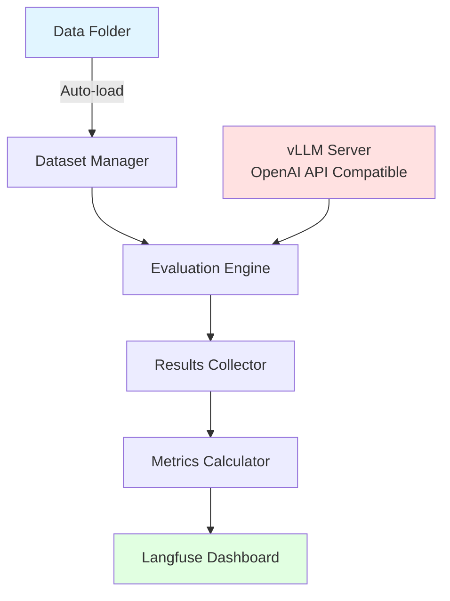

# LazyEval Platform - Project Overview

## Vision

LazyEval is an automated evaluation platform for language models that streamlines the process of testing models against datasets and generating comprehensive metrics.

## Core Objectives

1. **Model Hosting Integration**: Deploy and interact with models through vLLM, compatible with OpenAI API standards
2. **Automated Dataset Processing**: Automatically discover and load evaluation datasets from a designated folder
3. **Evaluation Execution**: Feed datasets to models and systematically collect responses
4. **Metrics Calculation**: Compute relevant evaluation metrics based on predefined criteria
5. **Results Management**: Integrate with Langfuse for metric tracking and dashboard visualization

## High-Level Architecture



## Key Components

### 1. Model Serving Layer
- **Technology**: vLLM (OpenAI API compatible)
- **Purpose**: Host and serve language models with efficient inference
- **Interface**: Standard OpenAI API endpoints

### 2. Dataset Management
- **Auto-discovery**: Scan designated folder for supported dataset formats
- **Validation**: Ensure datasets conform to expected schemas
- **Preprocessing**: Transform datasets into evaluation-ready format

### 3. Evaluation Engine
- **Orchestration**: Manage the flow from dataset → model → results
- **Batching**: Optimize API calls for efficiency
- **Error Handling**: Graceful handling of API failures and retries

### 4. Metrics & Analysis
- **Built-in Metrics**: Common NLP evaluation metrics (accuracy, BLEU, ROUGE, etc.)
- **Custom Metrics**: Extensible framework for domain-specific evaluation
- **Statistical Analysis**: Aggregate and summarize results

### 5. Langfuse Integration
- **Trace Logging**: Record all model interactions
- **Dashboard Visualization**: Real-time metrics and results viewing
- **Historical Tracking**: Compare evaluation runs over time

## Technology Stack (Proposed)

- **Language**: Python 3.11+
- **Framework**: FastAPI (for API layer)
- **Model Serving**: vLLM
- **LLM Client**: OpenAI SDK / httpx
- **Observability**: Langfuse
- **Logging**: loguru
- **Data Handling**: pandas, datasets (HuggingFace)
- **Type Safety**: Pydantic v2

## Design Principles

Following KISS, YAGNI, and Open/Closed principles:

1. **Start Simple**: Begin with basic file-based datasets, simple metrics
2. **Incremental Complexity**: Add features as requirements become clear
3. **Domain Modeling First**: Model the evaluation domain before implementation
4. **Type Safety**: Comprehensive type hints throughout
5. **Async Where Beneficial**: Use async for I/O-bound operations

## Project Structure (Proposed)

```
LazyEval/
├── src/
│   ├── domain/           # Domain models
│   ├── datasets/         # Dataset loading and management
│   ├── evaluation/       # Core evaluation engine
│   ├── models/           # Model client integration
│   ├── metrics/          # Metrics calculation
│   └── integrations/     # Langfuse and other integrations
├── data/                 # Dataset storage
├── configs/              # Configuration files
├── tests/                # Test suite
├── plans/                # Planning documents (current location)
└── pyproject.toml        # Project dependencies (uv)
```

## Success Criteria

- ✅ Automatically process all datasets in data folder
- ✅ Successfully interact with vLLM-hosted models via OpenAI API
- ✅ Calculate and store evaluation metrics
- ✅ Visualize results in Langfuse dashboard
- ✅ Extensible architecture for new datasets and metrics
