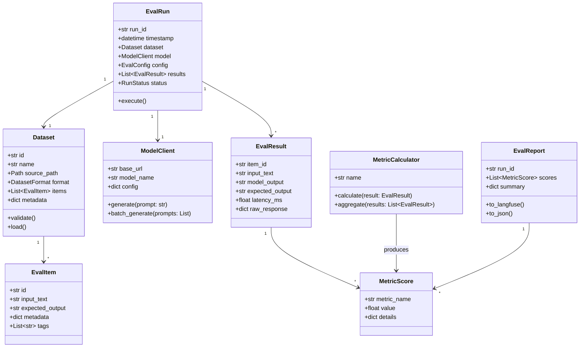
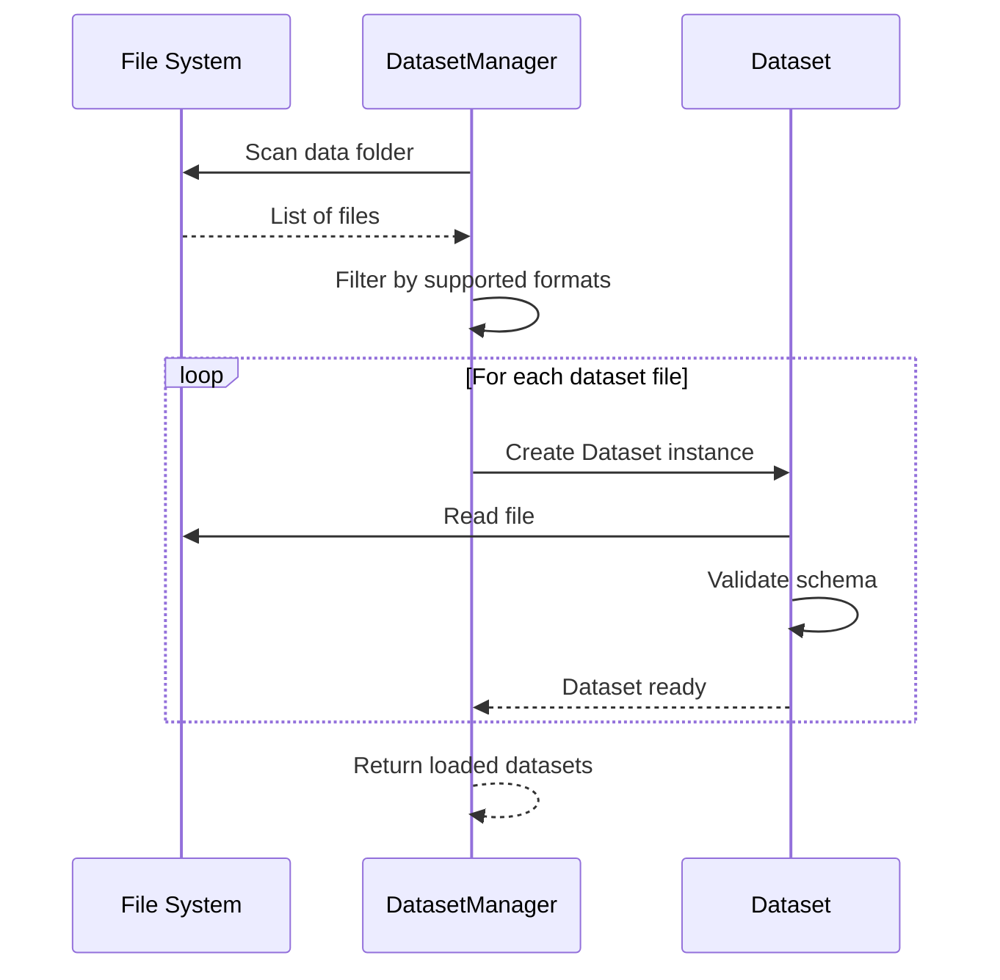
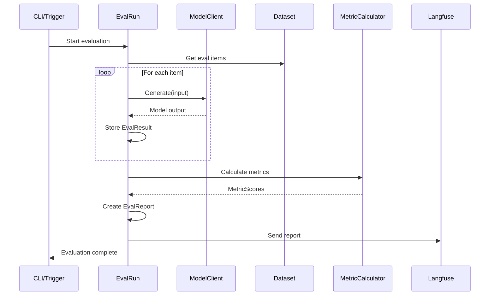

# LazyEval Platform - Domain Model

## Core Domain Entities

This document outlines the key domain entities and their relationships, following a domain-first approach.



## Entity Definitions

### 1. Dataset
**Purpose**: Represents a collection of evaluation items to be processed

**Domain Logic**:
- Auto-discovery from file system
- Validation of schema and required fields
- Lazy loading for large datasets
- Support multiple formats (start with JSON)

**Analogies**: 
- Like a test suite in software testing
- Like a benchmark dataset in ML research

### 2. EvalItem
**Purpose**: A single unit of evaluation (input + expected output)

**Domain Logic**:
- Immutable once loaded
- Self-contained (includes all necessary metadata)
- Supports optional fields for flexibility

**Analogies**:
- Like a test case in unit testing
- Like a single row in a database table

### 3. ModelClient
**Purpose**: Abstraction over the LLM inference API

**Domain Logic**:
- Encapsulates API communication
- Handles retries and error handling
- Supports batching for efficiency
- Configuration for temperature, tokens, etc.

**Analogies**:
- Like a database connection/adapter pattern
- Like a HTTP client wrapper

### 4. EvalRun
**Purpose**: Orchestrates a complete evaluation cycle

**Domain Logic**:
- Coordinates dataset → model → results flow
- Tracks execution state and progress
- Manages lifecycle (pending → running → completed → failed)
- Ensures idempotency (can safely retry)

**Analogies**:
- Like a CI/CD pipeline run
- Like a batch job in data processing

### 5. EvalResult
**Purpose**: Captures the outcome of one model inference

**Domain Logic**:
- Immutable record of what happened
- Includes timing information
- Preserves raw API response for debugging
- Links back to original EvalItem

**Analogies**:
- Like a test result (pass/fail + details)
- Like a database query result

### 6. MetricCalculator
**Purpose**: Computes evaluation metrics from results

**Domain Logic**:
- Pluggable architecture (easily add new metrics)
- Can operate on single result or aggregate
- Produces normalized scores (0-1 or similar)
- Includes metadata about calculation

**Analogies**:
- Like a reducer function in functional programming
- Like an analytics query in BI tools

### 7. MetricScore
**Purpose**: A computed metric value with context

**Domain Logic**:
- Named metric with numerical value
- Additional details/breakdown stored
- Supports comparison and trending

### 8. EvalReport
**Purpose**: Aggregated results and metrics for an evaluation run

**Domain Logic**:
- Summarizes all results and scores
- Integrates with Langfuse
- Exportable to multiple formats
- Human-readable summaries

**Analogies**:
- Like a test report in CI/CD
- Like a performance dashboard

## Domain Workflows

### Workflow 1: Dataset Discovery and Loading



### Workflow 2: Evaluation Execution



## Value Objects

### DatasetFormat
```python
from enum import Enum

class DatasetFormat(Enum):
    JSON = "json"
    JSONL = "jsonl"
    CSV = "csv"
    HUGGINGFACE = "hf"
```

### RunStatus
```python
class RunStatus(Enum):
    PENDING = "pending"
    RUNNING = "running"
    COMPLETED = "completed"
    FAILED = "failed"
    CANCELLED = "cancelled"
```

### EvalConfig
```python
from pydantic import BaseModel

class EvalConfig(BaseModel):
    temperature: float = 0.7
    max_tokens: int = 1000
    top_p: float = 1.0
    batch_size: int = 10
    max_retries: int = 3
    timeout_seconds: int = 30
```

## Repository Pattern (Minimal)

Following YAGNI, start with simple file-based storage:

- **DatasetRepository**: Load datasets from file system
- **ResultsRepository**: Save results to JSON/JSONL files (optional, if not only using Langfuse)

Can evolve to database later if needed.

## Invariants & Rules

1. **Dataset Immutability**: Once loaded, datasets don't change during evaluation
2. **Result Integrity**: All results must link to valid EvalItems
3. **Metric Determinism**: Same inputs → same metric values (for deterministic metrics)
4. **Run Isolation**: Each EvalRun is independent and doesn't affect others

## Extension Points

Following Open/Closed principle, these interfaces allow extension:

1. **IMetricCalculator**: Add custom metrics without changing core
2. **IDatasetLoader**: Support new dataset formats
3. **IModelClient**: Swap between different model providers
4. **IExporter**: Add new export formats beyond Langfuse

---

## Next: Implementation Patterns

Once the domain model is validated, we can proceed to:
1. Concrete implementation using Pydantic models
2. Service layer for orchestration
3. Repository implementations
4. Integration with vLLM and Langfuse
