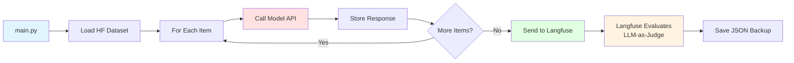

# LazyEval Platform - Requirements Summary

> **Generated**: 2026-02-04  
> **Based on**: Clarifying questions answered by user

## Key Design Decisions

### 1. Dataset Management ✅

**Primary Dataset**: `Mahesh2841/Agriculture` (HuggingFace)

**Schema**:
```json
{
  "instruction": "Answer the following question",
  "input": "What are some methods for improving soil fertility?",
  "response": "Improving soil fertility can be achieved through..."
}
```

**Discovery**: Scan on startup only (no watch mode)

**Validation**: 
- Must pass pytest tests before deployment
- Skip malformed records and log errors during runtime

**Extensibility**: Design for custom dataset loaders for future datasets

---

### 2. Model Integration ✅

**Deployment**: External endpoint (vLLM or any OpenAI-compatible API)

**Configuration Required**:
- `model_name`: Name of the model
- `base_url`: API endpoint URL  
- `api_key`: Authentication key

**API Parameters** (configurable):
- `temperature`
- `top_p` 
- `max_tokens`
- Non-streaming only

**Multiple Models**: Single model per run, but extensible design for future multi-model support

---

### 3. Evaluation Strategy ✅

**Evaluation Method**: **LLM-as-Judge** (via Langfuse)

> For the Agriculture dataset, evaluation will use an LLM to judge the quality of model responses compared to reference responses.

**Per-Dataset Evaluation**: Each dataset will define its own evaluation function

**Ground Truth**: Agriculture dataset includes reference `response` field for comparison

---

### 4. Langfuse Integration ✅

**Setup**: Existing Langfuse project (user will provide API key and project ID)

**Usage**:
- Trace logging for all model API calls
- Store LLM-as-Judge evaluation scores
- Primary results dashboard

---

### 5. Data Storage ✅

**Dual Storage**:
1. **Langfuse**: Primary storage and dashboard
2. **JSON files**: Local backup of evaluation results

---

### 6. Execution Workflow ✅

**Entry Point**: `uv run main.py`

**Behavior**: Automatic evaluation flow
- No CLI subcommands
- Simple, hardcoded logic (initially)
- Sequential processing (one input at a time)

**No Batching**: Process single inputs sequentially for simplicity

**No Concurrency**: Sequential execution only (KISS principle)

---

### 7. Configuration Management ✅

**Hybrid Approach**:
- **Environment Variables**: Sensitive data (API keys, endpoints)
- **YAML/TOML Files**: Application configuration

**Single Environment**: No dev/staging/prod separation for MVP

---

### 8. Scope Limitations (YAGNI) ✅

**Explicitly Out of Scope**:
- ❌ Plugin system for custom metrics
- ❌ Preprocessing/postprocessing steps  
- ❌ PDF/HTML report generation
- ❌ Email notifications
- ❌ Comparison views between runs
- ❌ Batch processing
- ❌ Parallel/concurrent execution
- ❌ Real-time dataset watching
- ❌ Multiple environments

**In Scope**:
- ✅ Custom dataset loaders (extensible)
- ✅ Single model evaluation
- ✅ Langfuse integration
- ✅ JSON backup storage
- ✅ Sequential processing

---

## Simplified Architecture



## Minimal Domain Model

### Core Entities

**AgricultureDatasetItem** (Pydantic Model):
```python
class AgricultureDatasetItem(BaseModel):
    instruction: str
    input: str
    response: str  # Ground truth
```

**ModelConfig**:
```python
class ModelConfig(BaseModel):
    model_name: str
    base_url: str
    api_key: str
    temperature: float = 0.7
    top_p: float = 1.0
    max_tokens: int = 1000
```

**EvalResult**:
```python
class EvalResult(BaseModel):
    item_id: str
    input_text: str
    instruction: str
    model_output: str
    expected_response: str
    latency_ms: float
    timestamp: datetime
```

**ModelClient**:
```python
class ModelClient:
    def __init__(self, config: ModelConfig):
        self.config = config
        self.client = OpenAI(base_url=config.base_url, api_key=config.api_key)
    
    async def generate(self, prompt: str) -> str:
        # Call OpenAI-compatible API
        ...
```

---

## Implementation Priorities

### Phase 1: Core Infrastructure
1. Project setup with `uv`
2. Pydantic models for dataset and config
3. Configuration management (env + YAML)
4. Logging with loguru

### Phase 2: Dataset Loading
1. Load `Mahesh2841/Agriculture` from HuggingFace
2. Validate schema with Pydantic
3. Skip and log malformed items
4. Unit tests for dataset loading

### Phase 3: Model Client
1. OpenAI-compatible client wrapper
2. Configuration from env vars + YAML
3. Error handling and retries
4. Integration tests with mock API

### Phase 4: Evaluation Flow
1. `main.py` entry point
2. Sequential processing loop
3. Store results in-memory, then export
4. Basic logging and progress tracking

### Phase 5: Langfuse Integration
1. Initialize Langfuse client (API key from env)
2. Send traces for each model call
3. Send evaluation results
4. Let Langfuse handle LLM-as-Judge scoring

### Phase 6: JSON Backup
1. Export results to timestamped JSON files
2. Structured format for analysis
3. Store in `results/` directory

### Phase 7: Testing & Polish
1. Pytest suite for each component
2. Integration test with mock HF dataset
3. Error handling improvements
4. Documentation (README, setup guide)

---

## Technology Stack (Finalized)

- **Python**: 3.11+
- **Package Manager**: `uv`
- **Models**: Pydantic v2
- **LLM Client**: OpenAI SDK (for generic API compatibility)
- **Dataset**: HuggingFace `datasets` library
- **Observability**: Langfuse SDK
- **Logging**: loguru
- **Testing**: pytest, pytest-mock
- **Config**: python-dotenv, PyYAML or TOML

---

## Project Structure

```
LazyEval/
├── src/
│   ├── __init__.py
│   ├── config/
│   │   ├── __init__.py
│   │   ├── models.py          # Pydantic config models
│   │   └── loader.py          # Load from env + YAML
│   ├── datasets/
│   │   ├── __init__.py
│   │   ├── base.py            # Base dataset interface
│   │   └── agriculture.py     # Agriculture dataset loader
│   ├── models/
│   │   ├── __init__.py
│   │   └── client.py          # OpenAI-compatible client
│   ├── evaluation/
│   │   ├── __init__.py
│   │   ├── runner.py          # Sequential evaluation logic
│   │   └── results.py         # Result models and storage
│   └── integrations/
│       ├── __init__.py
│       ├── langfuse_client.py # Langfuse integration
│       └── export.py          # JSON export
├── tests/
│   ├── test_config.py
│   ├── test_datasets.py
│   ├── test_model_client.py
│   └── test_evaluation.py
├── configs/
│   ├── config.yaml            # App configuration
│   └── .env.example           # Example env vars
├── results/                   # JSON backup outputs
├── logs/                      # Application logs
├── plans/                     # Planning docs (current)
├── main.py                    # Entry point (uv run main.py)
├── pyproject.toml             # Dependencies
└── README.md
```

---

## Success Criteria

1. ✅ Load `Mahesh2841/Agriculture` dataset from HuggingFace
2. ✅ Call external model API (OpenAI-compatible) with each input
3. ✅ Send traces to Langfuse with model responses
4. ✅ Langfuse performs LLM-as-Judge evaluation
5. ✅ Export results to timestamped JSON files
6. ✅ Handle errors gracefully (skip and log)
7. ✅ Run via `uv run main.py` with minimal configuration

---

## Configuration Example

**`.env`**:
```bash
MODEL_API_KEY=sk-xxxxx
MODEL_BASE_URL=https://api.example.com/v1
MODEL_NAME=llama-3-70b

LANGFUSE_PUBLIC_KEY=pk-xxxxx
LANGFUSE_SECRET_KEY=sk-xxxxx
LANGFUSE_HOST=https://cloud.langfuse.com
```

**`configs/config.yaml`**:
```yaml
model:
  temperature: 0.7
  top_p: 1.0
  max_tokens: 1000

dataset:
  name: "Mahesh2841/Agriculture"
  max_samples: null  # null = all samples

evaluation:
  skip_on_error: true

output:
  results_dir: "results"
  log_dir: "logs"
```

---

## Next: Detailed Implementation Plan

Ready to create a detailed implementation plan for Phase 0-3 (Core + Dataset + Model)?
